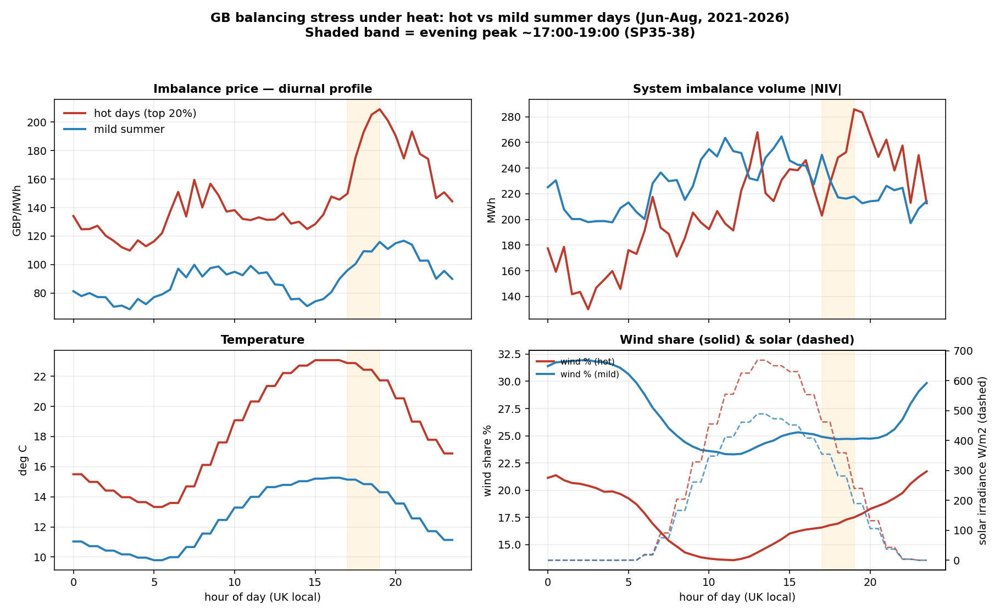
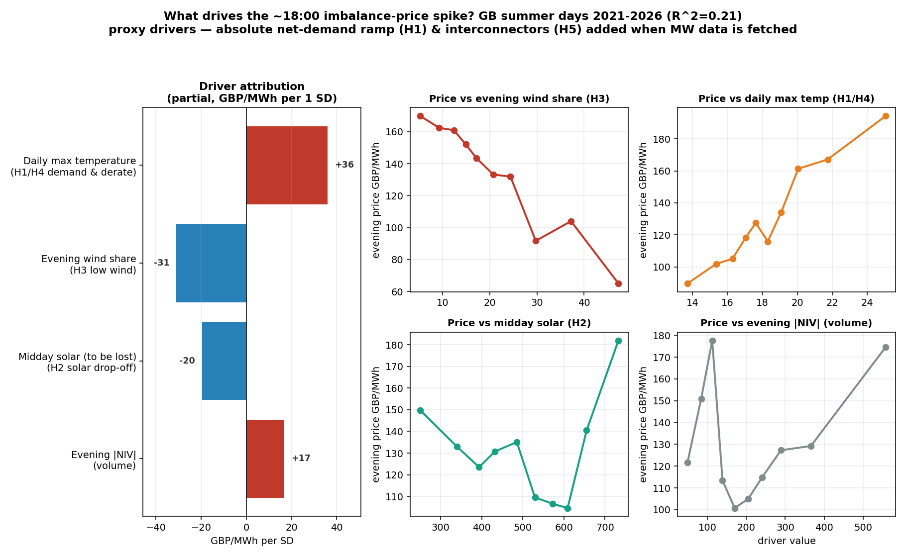

# heatwave-Imbalance

**How extreme heat stresses the GB balancing system — and what it means for a decarbonising grid.**

A climate-resilience analysis of the GB electricity imbalance (cash-out) price and Net Imbalance Volume (NIV) under hot weather, with a focus on the recurring **~18:00 evening price spikes**. The emphasis is on *understanding and ranking the physical drivers* of those spikes, not predicting them — see [`PHASE1_SCOPE.md`](PHASE1_SCOPE.md) for the full framing and the five hypotheses (H1–H5).

This project is a deliberate companion to **`uk-system-price-forecast`** and reuses its data and conventions (see [Compatibility](#compatibility)).

## First finding (real data, 2021–2026)

Across five summers, on the **hottest 20% of days** the imbalance price in the evening peak (≈17:00–19:00, SP35–38) is on average **~£77/MWh higher** than on mild summer days — yet average **|NIV| is essentially unchanged**. So at the national level the heat-related evening premium looks like a **scarcity-pricing / marginal-action-cost effect more than a volume effect**. The same hot days show **lower wind share** and **higher midday solar that collapses into the peak** — early support for H3 (low wind under anticyclonic heat) and H2 (solar drop-off).



> Caveat: at a population-weighted *national* level the hottest summer quintile tops out near ~21 °C, so this first cut uses a percentile "hot day" label. The strict Met Office heatwave definition (≥3 consecutive days over a regional absolute threshold) and the absolute net-demand decomposition come with the demand/FUELHH data (next step).

## Driver attribution (first pass)

Regressing each summer day's evening-peak (SP35–38) imbalance price on standardised physical drivers gives a rankable, partial attribution (R² ≈ 0.21, n = 460 days):

| Driver | Hypothesis | £/MWh per +1 SD | Spearman |
|---|---|--:|--:|
| Daily max temperature | H1/H4 demand & derate | **+36** | +0.21 |
| Evening wind share | H3 low wind | **−31** | −0.36 |
| Midday solar | H2 solar drop-off | −20 | +0.01 |
| Evening \|NIV\| | volume | +17 | +0.05 |



The two robust, large-t signals are **temperature (+) and wind share (−)**: hot, low-wind evenings carry the premium — exactly the anticyclonic-heat mechanism (H3 + thermal/demand stress). Wind share has the strongest univariate relationship (−0.36). Two honest nuances: the model explains only ~21% of day-to-day variation (evening spikes are tail/margin events these proxies don't fully capture), and midday solar flips sign between univariate (~0) and partial (−), because the proxy can't separate solar *level* from solar *drop-off*. Both point to the same gap — **absolute net demand, its evening ramp (H1), and interconnector imports (H5)**, which arrive once `fetch_demand`/`fetch_fuelhh` are run and should lift the explained variance. The pipeline auto-upgrades from "proxy" to "full" mode when those CSVs are present.

## Layout
```
PHASE1_SCOPE.md            project framing, hypotheses, method, deliverables
docs/DATA_SOURCES.md       confirmed BMRS dataset IDs / endpoints
src/config.py              paths; resolves the sister forecast repo for reuse
src/timeutils.py           UK settlement-time helpers (shared with forecast repo)
src/data/_http.py          retry/backoff + record parsing (house style)
src/data/fetch_elexon.py   imbalance price + NIV   (vendored from forecast repo)
src/data/fetch_weather.py  Open-Meteo UK weather   (vendored from forecast repo)
src/data/fetch_demand.py   NEW — INDO/ITSDO demand outturn (MW)
src/data/fetch_fuelhh.py   NEW — generation by fuel + interconnectors (MW)
src/features/build_drivers.py      driver table (proxy now / MW-aware when fetched)
src/analysis/heatwave_diurnal.py   anchor figure: hot vs mild diurnal profiles
src/analysis/spike_decomposition.py  H1-H5 driver attribution of the 18:00 spike
src/analysis/export_app_data.py    precompute the bundled data for the app
app/streamlit_app.py               read-only results presentation (Streamlit)
app/data/                          portable precomputed bundle the app reads
figures/                   generated figures
data/raw, data/processed   local datasets (gitignored)
```

## Quickstart

**Standalone** (no sister repo needed — fetch everything from open APIs):
```bash
pip install -r requirements.txt
python src/data/fetch_elexon.py   --start 2021-06-01 --end 2026-08-31   # price + NIV
python src/data/fetch_weather.py  --start 2021-06-01 --end 2026-08-31   # UK weather
python src/data/fetch_demand.py   --start 2022-06-01 --end 2022-08-31   # demand (MW)
python src/data/fetch_fuelhh.py   --start 2022-06-01 --end 2022-08-31   # gen by fuel (MW)
python src/analysis/heatwave_diurnal.py                                  # anchor figure
python src/analysis/spike_decomposition.py                               # H1-H5 attribution
```

**Reuse** the sister repo's already-downloaded data instead of re-fetching:
```bash
export UK_FORECAST_REPO=/path/to/uk-system-price-forecast
python src/analysis/heatwave_diurnal.py
```
`src/config.forecast_raw()` prefers the sister repo if `UK_FORECAST_REPO` is set (or it sits in `../uk-system-price-forecast`), and otherwise falls back to this repo's own `data/raw/`.

**Presentation app** (read-only, portable — reads the bundled `app/data/`, no live data needed):
```bash
pip install -r app/requirements.txt
python src/analysis/export_app_data.py   # refresh the bundle (optional; committed copy exists)
streamlit run app/streamlit_app.py
```
The app shows the headline metrics, the diurnal profiles (switchable series), the driver-attribution ranking + table, and the binned partial relationships, with the method caveats inline.

To publish a live link, deploy to Streamlit Community Cloud — it's self-contained (reads the committed `app/data/` bundle, no secrets). Steps in [`docs/DEPLOY.md`](docs/DEPLOY.md).

## Compatibility
Same `(settlement_date, settlement_period)` key, same UK-local SP convention, same retry/append/CLI fetcher pattern as `uk-system-price-forecast`. This project **reads that repo's** `system_prices_5yr.csv`, `weather_uk.csv` and `generation_mix.csv` directly (via `src/config.forecast_raw()`) and **adds** absolute-MW demand, generation-by-fuel and interconnector tables on top — so the new physical-driver series can flow back into the forecasting pipeline later if useful.

## Status
Phase 1, in progress. Done: scope, reuse scaffolding, two new BMRS fetchers, anchor figure, and a first-pass H1–H5 driver attribution (proxy mode). Next: run `fetch_demand`/`fetch_fuelhh` over the heatwave windows to unlock full mode (net-demand ramp H1 + interconnectors H5), add Sheffield PV_Live for absolute embedded solar, and write the short public writeup.
